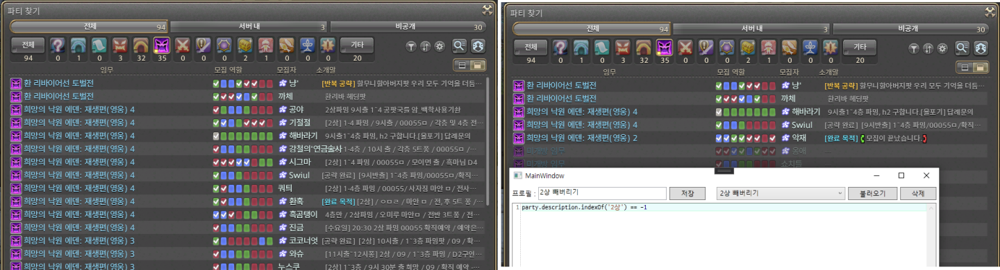

# Paust

- Paust는 파이널 판타지 14 인게임 파티 찾기에 다양한 필터링과 유틸 기능을 제공합니다.

- Paust는 DalamudKr의 확장 프로그램으로 제공됩니다.

- 이 프로그램의 사용으로 인한 모든 피해는 사용자에게 있고, 제작자는 그 어떤 책임도 지지 않습니다.

- 이 프로그램은 [Affero General Public License v3](/LICENSE) 하에 배포됩니다

## [LICENSE](/LICENSE)

## 요구 사항

- DalamudKr가 적용된 dx11 클라이언트

## 사용방법

- DAlamudKr 플러그인 목록에서 `Paust`를 검색하여 설치합니다.

### 긴 닉네임 줄이기


### 타 서버 표시 끄기


### 임무 정보 표시 끄기


### Javascript

- 반환값이 true 일 때 파티를 표시하고, false 일 때 파티를 숨깁니다.

- [`Jint`]https://github.com/sebastienros/jint) 라이브러리를 사용하여 아래와 같은 스펙을 지원합니다.

    - `ECMAScript 5.1 (ES5)` 호환

- 예시1 : 재생 영식에서 파티 설명에 `2상` 혹은 `파밍`이 포함된 파티 제외

    ```js
    party.is_eden && party.description.indexOf('2상') == -1 && party.description.indexOf('파밍') == -1
    ```

- 예시2 : 재생 영식에서 적마도사를 모집중이며, 파티에 다른 캐스터가 없는 파티만 표시.

    ```js
    (function() {
        if (!party.is_eden) return false;
        
        var anyCaster = false;
        for (var i = 0; i < party.slot_count; i++) {
            var slot = party.slot[i];

            // 다른 캐스터 제외
            if (slot.in_slot == jobs.blm || slot.in_slot == jobs.smn || slot.in_slot == jobs.rdm) {
                return false;
            }

            // 확직예약 제외
            if (slot.available_jobs == 1 && (slot.blm || slot.smn || slot.rdm)) {
                return false;
            }
            
            // 적마도사 모집 중인 자리가 있음.
            if (slot.available_jobs > 1 && slot.rdm) {
                anyCaster = true;
            }
        }

        return anyCaster;
    })()
    ```

- [party 변수](#party-변수)
- [직업 고유번호](#직업-고유번호)
- [모집 직업 플래그](#모집-직업-플래그)
- [알려진 임무](#알려진-임무)
- [전리품 규칙](#전리품-규칙)
- [목적](#목적)

#### party 변수

- party는 아래와 같은 형태의 구조를 가지고 있으며, 이를 이용하여 파티 필터링을 진행합니다.

```javascript
var party = {
    "owner_name"       : "륜아린",                  // 파티 모집자 이름
    "description"      : "파티찾기 테스트입니다.",  // 모집 설명
    "remaining_seconds": 3038,      // 모집 남은 시간
    "content_category" : 0,         // 모집 카테고리
    "content_id"       : 748,       // 임무 종류
    "is_eden"          : false,     // content_id 가 에덴 9층 ~ 12층일 떄 true
    "is_roulette"      : false,     // 무작위 임무?
    "party_count"      : 1,         // 파티 수
    "is_private"       : false,     // 비공개 파티
    "is_24"            : false,     // 24인 파티?
    "same_server"      : false,     // 같은 서버만 모집
    "no_dup_job"       : false,     // 잡 중복 없음
    "welcome_beginner" : false,     // 초보자 환영
    "undersize_player" : false,     // 인원수 제한 해제
    "minimum_level"    : 0,         // 입장 최소 레벨
    "silence_echo"     : false,     // 초월하는 힘 없음
    "item_rule"        : 0,         // 전리품 규칙 (하단 item_rules 참조)
    "slot_count"       : 8,         // 모집 인원 수
    "objective"        : 0,         // 파티 목적

    // 24인의 경우에는 빈 배열
    "slot": [
        {
            "in_slot": 19, // 현재 자리에 있는 사람의 직업. 0 이면 모집 중
            
            "available_jobs": 0 // 모집중인 직업 수
            "_tank"       : false, // 탱커 모집 중
            "_heal"       : false, // 힐러 모집 중
            "_deal"       : false, // 딜러 모집 중
            "_deal_meele" : false, // 근거리 모집 중
            "_deal_range" : false, // 유격대 모집 중
            "_deal_caster": false, // 캐스터 모집 중

            // 이하 모집 중인 직업
            "_raw": 256,  // 모집중인 직업 원시값 (모집 직업 플래그 참조)

            "gld": false, // 검술사
            "pld": false, // 나이트
            "mrd": false, // 도끼술사
            "war": false, // 전사
            "drk": false, // 암흑기사
            "gnb": false, // 건브레이커

            "cnj": false, // 환술사
            "whm": false, // 백마도사
            "sch": false, // 학자
            "ast": false, // 점성술사

            "pgl": false, // 격투가
            "mnk": false, // 몽크
            "lnc": false, // 창술사
            "drg": false, // 용기사
            "rog": false, // 쌍검사
            "nin": false, // 닌자
            "sam": false, // 사무라이
            
            "arc": false, // 궁술사
            "brd": false, // 음유시인
            "mch": false, // 기공사
            "dnc": false, // 무도가
            
            "thm": false, // 주술사
            "blm": false, // 흑마도사
            "acn": false, // 비술사
            "smn": false, // 소환사
            "rdm": false, // 적마도사

            "blu": false, // 청마도사
        },
        ...
    ]
};
```

#### 직업 고유번호

- 각 직업의 고유번호를 담고 있습니다.

|상수 이름|값|설명|
|-|-|-|
|`jobs.gla`|`1`|검술사|
|`jobs.pgl`|`2`|격투사|
|`jobs.mrd`|`3`|도끼술사|
|`jobs.lnc`|`4`|창술사|
|`jobs.arc`|`5`|궁술사|
|`jobs.cnj`|`6`|환술사|
|`jobs.thm`|`7`|주술사|
|`jobs.crp`|`8`|목수|
|`jobs.bsm`|`9`|대장장이|
|`jobs.arm`|`10`|갑주제작사|
|`jobs.gsm`|`11`|보석공예가|
|`jobs.ltw`|`12`|가죽공예가|
|`jobs.wvr`|`13`|재봉사|
|`jobs.alc`|`14`|연금술사|
|`jobs.cul`|`15`|요리사|
|`jobs.min`|`16`|광부|
|`jobs.btn`|`17`|원예가|
|`jobs.fsh`|`18`|어부|
|`jobs.pld`|`19`|나이트|
|`jobs.mnk`|`20`|몽크|
|`jobs.war`|`21`|전사|
|`jobs.drg`|`22`|용기사|
|`jobs.brd`|`23`|음유시인|
|`jobs.whm`|`24`|백마도사|
|`jobs.blm`|`25`|흑마도사|
|`jobs.acn`|`26`|비술사|
|`jobs.smn`|`27`|소환사|
|`jobs.sch`|`28`|학자|
|`jobs.rog`|`29`|쌍검사|
|`jobs.nin`|`30`|닌자|
|`jobs.mch`|`31`|기공사|
|`jobs.drk`|`32`|암흑기사|
|`jobs.ast`|`33`|점성술사|
|`jobs.sam`|`34`|사무라이|
|`jobs.rdm`|`35`|적마도사|
|`jobs.blu`|`36`|청마도사|
|`jobs.gnb`|`37`|건브레이커|
|`jobs.dnc`|`38`|무도가|

#### 모집 직업 플래그

- `party.slot[##]` 의 _raw 값이며, 모집중인 직업이 or 연산으로 담겨 있습니다.

|상수 이름|값|설명|
|-|-|-|
|`slot_flags.tank`||탱커|
|`slot_flags.heal`||힐러|
|`slot_flags.deal`||딜러|
|`slot_flags.deal_meele`||근딜|
|`slot_flags.deal_range`||원딜|
|`slot_flags.deal_caster`||캐스터|
|`slot_flags.gld`|`1 <<  1`|검술사|
|`slot_flags.pgl`|`1 <<  2`|격투사|
|`slot_flags.mrd`|`1 <<  3`|도끼술사|
|`slot_flags.lnc`|`1 <<  4`|창술사|
|`slot_flags.arc`|`1 <<  5`|궁술사|
|`slot_flags.cnj`|`1 <<  6`|환술사|
|`slot_flags.thm`|`1 <<  7`|주술사|
|`slot_flags.pld`|`1 <<  8`|나이트|
|`slot_flags.mnk`|`1 <<  9`|몽크|
|`slot_flags.war`|`1 << 10`|전사|
|`slot_flags.drg`|`1 << 11`|용기사|
|`slot_flags.brd`|`1 << 12`|음유시인|
|`slot_flags.whm`|`1 << 13`|백마도사|
|`slot_flags.blm`|`1 << 14`|흑마도사|
|`slot_flags.acn`|`1 << 15`|비술사|
|`slot_flags.smn`|`1 << 16`|소환사|
|`slot_flags.sch`|`1 << 17`|학자|
|`slot_flags.rog`|`1 << 18`|쌍검사|
|`slot_flags.nin`|`1 << 19`|닌자|
|`slot_flags.mch`|`1 << 20`|기공사|
|`slot_flags.drk`|`1 << 21`|암흑기사|
|`slot_flags.ast`|`1 << 22`|점성술사|
|`slot_flags.sam`|`1 << 23`|사무라이|
|`slot_flags.rdm`|`1 << 24`|적마도사|
|`slot_flags.blu`|`1 << 25`|청마도사|
|`slot_flags.gnb`|`1 << 26`|건브레이커|
|`slot_flags.dnc`|`1 << 27`|무도가|

#### 알려진 임무

|상수 이름|값|설명|
|-|-|-|
|`content_ids.e9s`       |`750`|희망의 낙원 에덴: 재생편(영웅) 1|
|`content_ids.e10s`      |`748`|희망의 낙원 에덴: 재생편(영웅) 2|
|`content_ids.e11s`      |`752`|희망의 낙원 에덴: 재생편(영웅) 3|
|`content_ids.e12s`      |`759`|희망의 낙원 에덴: 재생편(영웅) 4|
|`content_ids.gunnhildr` |`760`|군힐드 사원|
|`content_ids.gunnhildrs`|`761`|군힐드 사원 (영웅)|
|`content_ids.leviathan` |`776`|환 리바이어선 토벌전|
|`content_ids.diamond`   |`782`|극 다이아몬드 웨폰 포획작전|
|`content_ids.bahamut`   |`280`|절 바하무트 토벌전|
|`content_ids.ultima`    |`539`|절 알테마 웨폰 파괴작전|
|`content_ids.alexander` |`694`|절 알렉산더 토벌전|

#### 전리품 규칙

|상수 이름|값|설명|
|-|-|-|
|`item_rules.normal`|`0`|일반 전리품 규칙|
|`item_rules.greed` |`1`|선입찰 금지|
|`item_rules.master`|`2`|파티장 분배|

#### 목적

|상수 이름|값|설명|
|-|-|-|
|`objectives.none`            |`0`|설정 안 함|
|`objectives.duty_completion` |`1`|완료 목적|
|`objectives.practice`        |`2`|연습|
|`objectives.loot`            |`4`|반복 공략|
